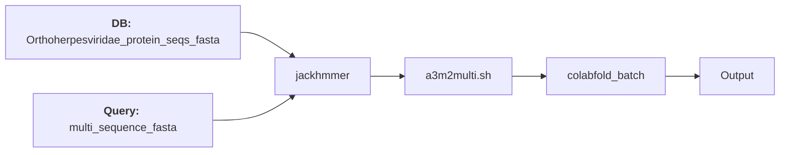

# Improving the quality AlphaFold predicted protein complex structure by MSA optimization

- ## The goal of this project is obtain better AlphaFold models for XYZ complex, in terms of the following scores:
  - ipTM score
  - pTM score
  - PAE score
  - pLDDT score

## MSA optimization strategies
### Strategies implemented thus far:
#### Default strategy

#### Strategy #1 (Tom)

