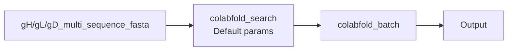
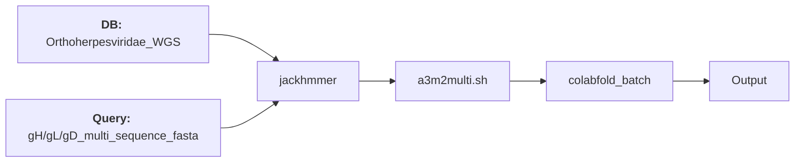
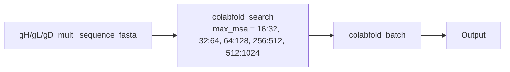
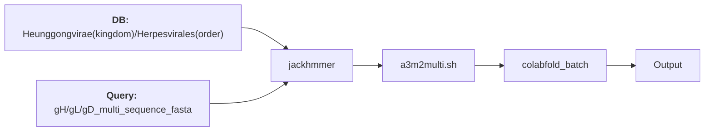
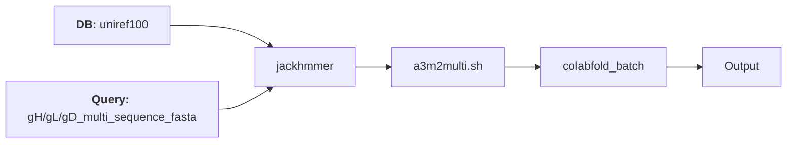
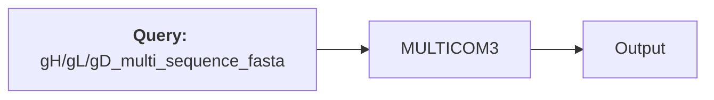

# Improving the quality AlphaFold predicted protein complex structure by MSA optimization

## IMPORTANT: Other parameters also affect the quality of the resulting structures (TBD):
  - Number of recycles
  - Random seeds 
- ## The goal of this project is obtain better AlphaFold models for gH/gL/gD complex, w.r.t. the following scores:
  - ipTM score
  - pTM score
  - PAE score
  - pLDDT score

## MSA optimization strategies
### Strategies implemented thus far:
#### Default strategy

#### Strategy #1 - Tom

#### Strategy #2 - Variable MSA depth using colabfold_search

#### Strategy #3 - MSAs using WGS sequences at various levels of the taxonomic hierarchy

#### Strategy #4 - MAFFT + uniref90/WGS + GUIDANCE 

#### Strategy #5 - [MULTICOM3](https://www.nature.com/articles/s42004-023-00991-6#Tab3) 

