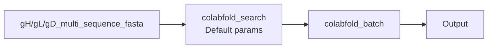
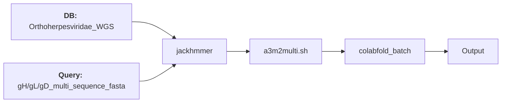
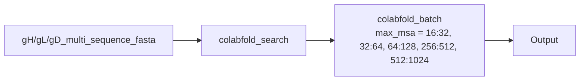
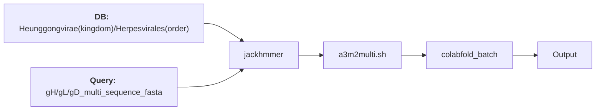
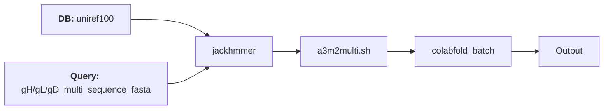
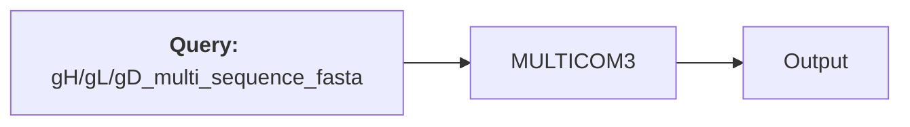
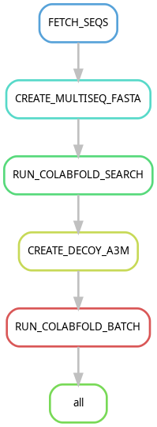

# Improving the quality AlphaFold predicted gH/gL/gD complex structure by MSA optimization

## IMPORTANT: Other parameters also affect the quality of the resulting structures (TBD):
  - Number of recycles
  - Random seeds 
- ## The goal of this project is obtain better AlphaFold models for gH/gL/gD complex, w.r.t. the following scores:
  - ipTM score
  - pTM score
  - PAE score
  - pLDDT score

## MSA optimization strategies
### Strategies implemented thus far:
#### Default strategy

#### Tom's Strategy

#### Strategy #2 - Variable MSA depth using colabfold_search

#### Strategy #3 - MSAs using WGS sequences at various levels of the taxonomic hierarchy

#### Strategy #4 - MAFFT + uniref90/WGS + GUIDANCE 

#### Strategy #5 - [MULTICOM3](https://www.nature.com/articles/s42004-023-00991-6#Tab3) 

## INSTRUCTIONS
#### Clone this repository
`git clone https://github.com/ntnn19/Tom_Topf.git`
### Prerequisits

- Install [Mambaforge](https://github.com/conda-forge/miniforge#mambaforge) (includes mamba)

- Build the [colabfold Singularity container](https://github.com/sokrypton/ColabFold/wiki/Running-ColabFold-in-Docker) by executing the following command:
`singularity pull docker://ghcr.io/sokrypton/colabfold:1.5.5-cuda12.2.2`
  - This will create a `colabfold_1.5.5-cuda12.2.2.sif` file
  - **Note:** The download directory <YOUR_CONTAINERS_DIR> should not be a subdirectory in this repository directory.

### Pipeline Setup
#### Mamba (Manual)
1. This workflow can be easily setup manually with the given environment file. Install Snakemake and dependencies using the command:
`mamba env create -f environment.yml`
2. Then activate the newly created environment with:
`mamba activate hsv-1`
3. **modify the config file as follows:**
containers_dir: /path/to/your/containers_directory
4. Execute the pipeline with:
`./run_workflow.sh`
#### Workflow

